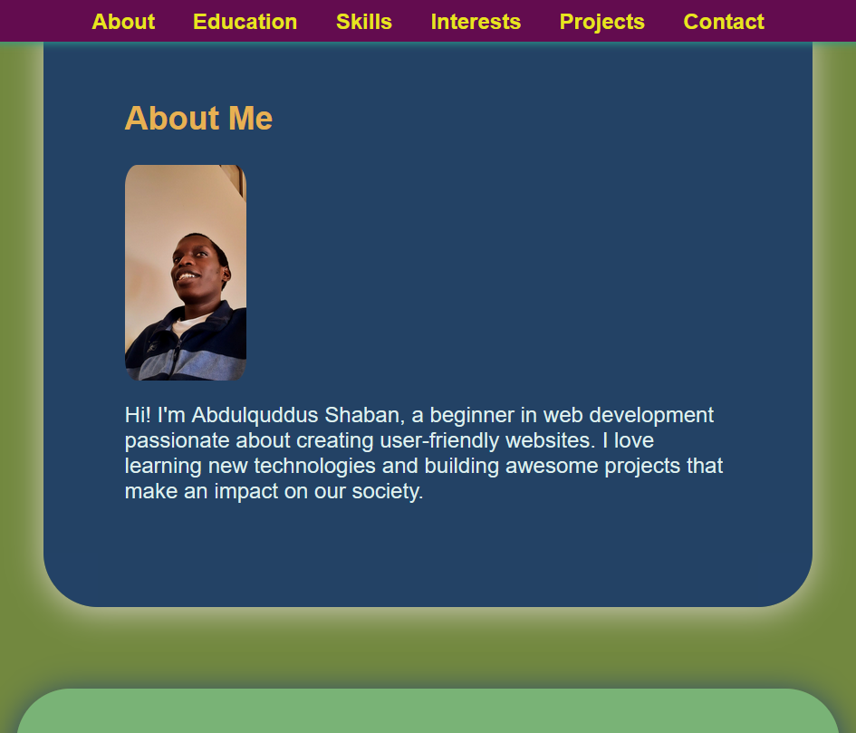

# 🚀 Abdulquddus Shaban | Portfolio Website

Welcome to my personal portfolio! This site is a reflection of my journey as a beginner web developer, built entirely with **HTML5** and **vanilla CSS**. It showcases my skills, interests, and projects—all wrapped in a clean, responsive design.

---

## 🧾 Overview

> _"Building the future, one line of code at a time."_

This portfolio is designed to be simple, accessible, and visually appealing. It includes sections about me, my education, skills, interests, and projects, along with a contact form and social links.

---

## 🛠️ Tech Stack

| Technology | Purpose |
|------------|---------|
| **HTML5**  | Structure and semantics |
| **CSS3**   | Styling and layout |
| **GitHub** | Hosting and version control |

---

## 📁 File Structure

---

## ✨ Features

- ✅ Semantic HTML layout
- ✅ Responsive navigation bar
- ✅ Downloadable CV
- ✅ Skills and interests section
- ✅ Project showcase with screenshots
- ✅ Accessible contact form
- ✅ Social media integration

---

## 🌐 Deployment

You can deploy this portfolio using **GitHub Pages**:

1. Push your project to a GitHub repository (e.g., `Wanchah/portfolio`)
2. Go to **Settings** → **Pages**
3. Under **Source**, select your branch (e.g., `main`) and root folder (`/`)
4. Click **Save**  
5. Your site will be live at:  You got it! Here's your complete and polished README.md file—all in one, ready to copy and paste directly into your project:

# 🚀 Abdulquddus Shaban | Portfolio Website

Welcome to my personal portfolio! This site is a reflection of my journey as a beginner web developer, built entirely with **HTML5** and **vanilla CSS**. It showcases my skills, interests, and projects—all wrapped in a clean, responsive design.

---

## 🧾 Overview

> _"Building the future, one line of code at a time."_

This portfolio is designed to be simple, accessible, and visually appealing. It includes sections about me, my education, skills, interests, and projects, along with a contact form and social links.

---

## 🛠️ Tech Stack

| Technology | Purpose |
|------------|---------|
| **HTML5**  | Structure and semantics |
| **CSS3**   | Styling and layout |
| **Flexbox**| Responsive design |
| **GitHub** | Hosting and version control |

---

## 📁 File Structure


├── index.html ├── assets/ │   ├── styles.css │   ├── Myimg1.jpg │   ├── portfolio-sample.png │   ├── github-original.svg │   ├── linkedin-original.svg │   └── my_cv.pdf └── favicon.ico

---

## ✨ Features

- ✅ Semantic HTML layout
- ✅ Responsive navigation bar
- ✅ Downloadable CV
- ✅ Skills and interests section
- ✅ Project showcase with screenshots
- ✅ Accessible contact form
- ✅ Social media integration

---

## 🌐 Deployment

You can deploy this portfolio using **GitHub Pages**:

1. Push your project to a GitHub repository (e.g., `Wanchah/portfolio`)
2. Go to **Settings** → **Pages**
3. Under **Source**, select your branch (e.g., `main`) and root folder (`/`)
4. Click **Save**  
5. Your site will be live at:  


https://Wanchah.github.io/portfolio/

---

## 📬 Contact

Feel free to connect or reach out:

- 🌐 [GitHub](https://github.com/Wanchah)
- 💼 [LinkedIn](https://linkedin.com/in/Abdulquddus-wancha)
- 📧 Contact form available on the site

---

## 📌 License

© 2025 Abdulquddus Shaban. All rights reserved.

---

## 💡 Future Enhancements

- Add media queries for improved mobile responsiveness
- Introduce subtle CSS animations or transitions
- Expand project section with live demos
- Optimize accessibility with skip links and ARIA roles

---

Thanks for visiting! 🙌



Would you like help writing a short project description for your GitHub repo or customizing your favicon and meta tags for better SEO?

